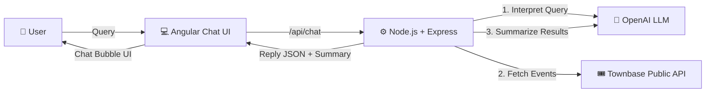

# 🤖 Townbase Chatbot Demo

## 1️⃣ Summary

This project is a **full-stack chatbot** prototype built for the **Townbase assignment**.
It connects users with **local event data** from the Townbase API and enhances the experience with **LLM models (OpenAI)** for query interpretation, spelling correction, and natural conversational responses.

### 🔹 Backend (Node.js + Express)

* 🚀 REST API (`/api/chat`) that:

  * 📝 Accepts free-form user queries.
  * 🧠 Uses **LLM (OpenAI)** to interpret intent (fix spelling, extract keywords, infer date/city).
  * 🎟 Fetches events from **Townbase Public API**.
  * 💬 Uses **LLM summarization** to return natural, chat-like answers.
* 🔑 Configurable with `.env`.

### 🔹 Frontend (Angular + SCSS)

* 💻 Simple **chat interface** styled with SCSS.
* 👤 User types queries → calls backend `/api/chat`.
* 💬 Displays **chat bubbles** for user + bot.
* 🎟 Shows event name, time, location, and links.

### ⚡ Performance note

Right now the chatbot may feel **a bit slow** due to:

* ⏳ LLM latency (2 calls per query).
* 🐢 Townbase API response time.

**How to improve**:

* 🔄 Add **Redis caching** for repeated queries.
* ⚡ Use **streaming responses** from OpenAI.
* 🧩 Merge interpretation + summarization in a single LLM call.
* 🤖 Try smaller/faster models (`gpt-4o-mini`, local LLM).

---

## 2️⃣ How to Start

### 🔹 Backend (Node.js + Express)

```bash
cd backend
npm install
cp .env.example .env   # add your API keys
npm run dev
```

👉 Runs at: **[http://localhost:8000](http://localhost:8000)**

### 🔹 Frontend (Angular + SCSS)

```bash
cd frontend
npm install
ng serve --open
```

👉 Runs at: **[http://localhost:4200](http://localhost:4200)**

---

## 3️⃣ Test 🧪

Manual test:

1. Run **backend** + **frontend**.
2. Open browser → [http://localhost:4200](http://localhost:4200).
3. Ask queries like:

   * 🎶 “sho me concarts in helsinki tommorow” → spelling fixed ✅
   * 👨‍👩‍👧 “events for kids next weekend” → filtered ✅
   * 😂 “any comedy shows tonight?” → fallback suggestions ✅

Bot should reply with a **friendly summary + structured event list**.

---

## 4️⃣ How to Scale It 📈

### Backend

* 🗄 Cache with **Redis**.
* 📩 Queue with **RabbitMQ/Kafka** for heavy traffic.
* 🔥 Split into microservices (LLM service, API proxy, frontend).
* ☁️ Deploy on **Kubernetes (HPA autoscaling)**.

### Frontend

* 📦 Build: `ng build --configuration production`
* 🌍 Serve via **Nginx/CDN**.
* 🔍 Add **Angular Universal** (SSR) for SEO.

### LLM

* ⚡ Use smaller models for query parsing.
* 🎯 Run summarization only for premium users.
* 📚 Add **RAG pipelines** for historical events.

---

## 🏗 Architecture

Here’s how the system works:



---

✅ With this setup you delivered:

* 🎯 **Full-stack chatbot** (Angular frontend + Node backend).
* 🔗 **Townbase API integration**.
* 🧠 **LLM-powered natural UX**.
* 🚀 Future-ready with scaling plan + AI extensions.

---
